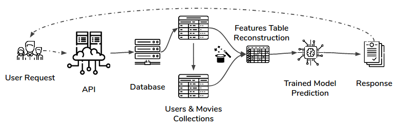

Movie Time is a collaborative recommender system based on Machine Learning using the [MovieLens Dataset](https://grouplens.org/datasets/movielens/latest/)  and the metadata of the movies from Kaggle's [The Movies Dataset](https://www.kaggle.com/rounakbanik/the-movies-dataset). Using Scikit-Learn for both Clustering and user rating prediction. The feature extraction and Machine Learning process are written in Pandas and Dask for full scalability. The data is stored on a MongoDB Atlas and is accessible through a bottle based API deployed in Heroku.

### 1. The Pipeline 

(To see an example of the process explained below, go to [pipeline.ipynb](https://github.com/castares/movie-time/blob/master/pipeline.ipynb) notebook.)

1.1. Features Extraction:
The original Dataset consisted of a list of movie ratings, including four columns: Timestamp, User Id, Movie Id, and a Rating from 0 to 5. Using that information and the metadata of the movies, I have extracted up to 30 columns, including the mean of user and movie ratings, the movie popularity (count of ratings within the Dataset), the genres of the movies (dummy columns for each available genre), and the day of the week in which the rating has been done (also dummy columns). 

1.2 Clustering:
Taking some of the features, I have created a dataframe with the users and their preferences of movie genres. To do this I summed the genres dummy columns from each movie rating and normalized the results. I passed this table to a Spectral Clustering algorithm to obtain 4 Clusters of users.

1.3 Movie Rating Prediction: 
Using the whole dataset with the extracted features, I have searched for the best algorithm to predict user ratings, using RSME as the metric. I obtained the best results with the Gradient Boosting Regressor with their default parameters (the metric does not get better with tuning), getting an RSME of 0.81.

1.4 The Database:
Once the Clusters are defined, I have stored separately the data in MongoDB Atlas, splitting the data into three collections: Users, Movies & Metadata. To interact with this data, see below the [API documentation](https://github.com/castares/movie-time/blob/master/API_Documentation.md).

### 2. The API

(To see the full documentation of the API, go to [API documentation](https://github.com/castares/movie-time/blob/master/API_Documentation.md)).

API URL: https://movie-time-api.herokuapp.com/

To be able to produce recommendations at the user's demand, I have built an API using Bottle's Framework. The central endpoint of this API is */user/[userid]/recommendation*. 

When a request is received on that endpoint the below process starts: 

a) A function checks to which Cluster is assigned the user makes a list of all movies included in the Cluster (this means, all movies watched by all users in that cluster), excluding the ones already watched by the user. 

b) Another function builds a table of features of those movies for the trained model. 

c) The trained model (a Gradient Boosting Regressor in this case), produces a prediction. 

d) The response from the API includes the 10 top-rated predictions.

On top of that endpoint, the API allows wide access to the users activity, the metadata of the movie, etc. Either for analysis purposes, to build a Frontend on top of it, or anything else.